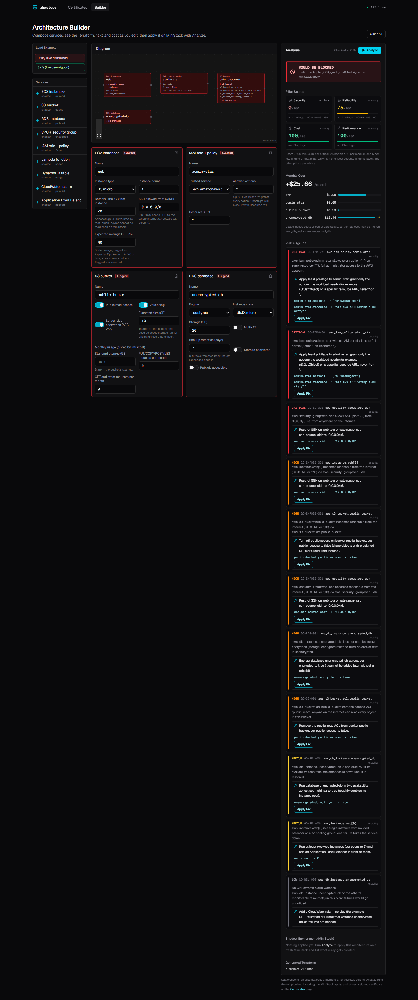
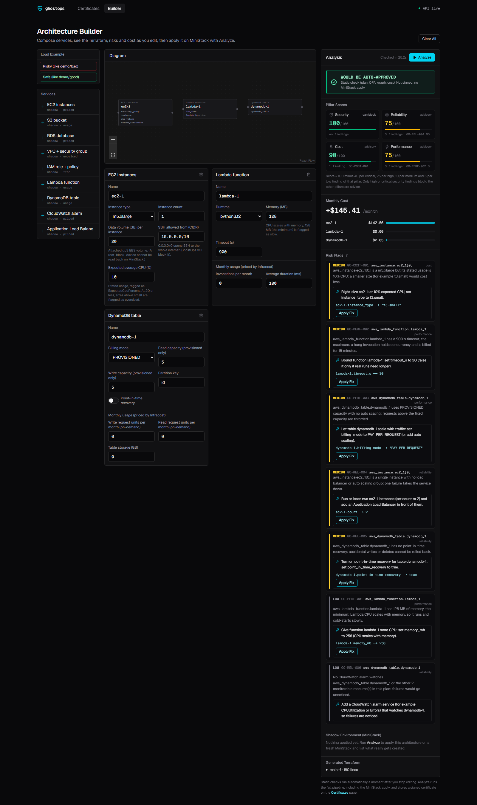
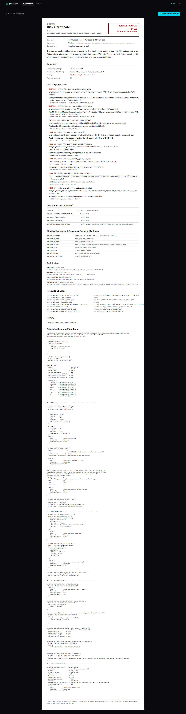
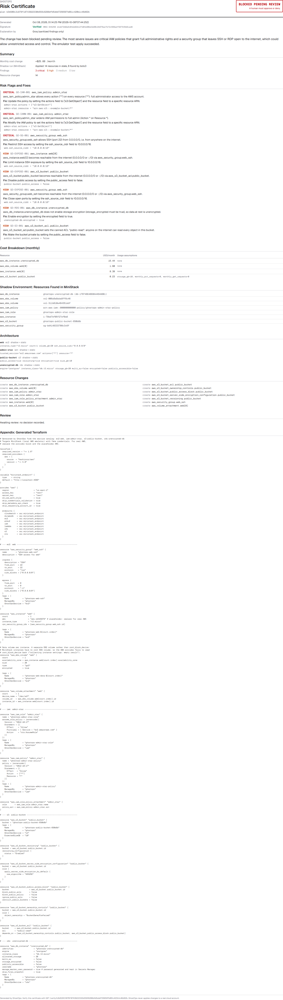

# GhostOps

**A safety layer between an AI coding agent and a real cloud account.**
GhostOps takes a Terraform plan, checks it for security and cost risk, replays it on a free
local AWS emulator, and issues a signed **Risk Certificate**. Low-risk changes are
auto-approved; anything risky is blocked until a human approves or denies it.

College Cloud Architecture Design project. Everything here runs locally and is free:
no real AWS credentials, no paid services.

You can feed it a plan from any Terraform project, or design one in the **Architecture
Builder**: pick AWS services, set their options, and watch the generated Terraform, risk
flags, suggested fixes and monthly cost update as you edit.



## The problem

AI coding agents can now write and apply infrastructure-as-code. A single plausible-looking
Terraform change can open SSH to the whole internet, grant `Action: "*"` on `Resource: "*"`,
make a bucket public, or quietly add monthly cost, and `terraform plan` output is long enough
that a tired human skims past it. Asking the agent "is this safe?" is not a control.

GhostOps puts a deterministic, auditable gate in that path: every plan gets the same checks,
the result is a tamper-evident certificate, and a human decides whenever the risk is real.

## Architecture

```mermaid
flowchart LR
    agent["AI agent / engineer<br/>terraform plan + show -json"] --> api["GhostOps API<br/>FastAPI · CLI"]

    subgraph analysis["Analysis of one plan"]
        parser["Plan parser<br/>normalise resource changes"]
        opa["OPA / Rego rules<br/>static security checks"]
        graph["NetworkX blast radius<br/>before/after graph diff"]
        shadow["Shadow run<br/>apply on MiniStack, then reset"]
        cost["Infracost<br/>monthly cost delta"]
    end

    api --> parser
    parser --> opa
    parser --> graph
    parser --> shadow
    parser --> cost

    opa --> cert["Risk Certificate<br/>verdict + HMAC-SHA256 signature"]
    graph --> cert
    shadow --> cert
    cost --> cert
    cert -. "sanitized rule ids, resource types, severities" .-> groq["Groq LLM<br/>2-3 sentence explanation"]
    groq -.-> cert

    cert --> db[("SQLite<br/>certificates + append-only audit log")]
    db --> dash["Next.js dashboard"]
    dash -- "approve / deny (recorded, never applied)" --> db
```

| Stage | What it does |
|---|---|
| Plan parser (`backend/app/plan_parser.py`) | Normalises `terraform show -json` into create / update / delete / replace / no-op changes. Unknown actions are an error, never ignored. |
| Policy engine (`backend/rules/`, `app/policy_engine.py`) | Rego v1 rules run by the `opa` binary. Fails closed: if OPA cannot run, the plan is blocked. |
| Blast radius (`app/blast_radius.py`) | Builds before/after resource graphs (references + matching ids/ARNs) and reports what becomes reachable from `0.0.0.0/0` and which IAM permissions widen. |
| Shadow run (`app/shadow.py`) | Copies the Terraform directory, forces the AWS provider onto MiniStack with fake keys (override file + scrubbed environment), applies on a freshly reset MiniStack, records the resulting resources, resets again. |
| Cost delta (`app/cost.py`) | Prices the before and after states with Infracost and reports the monthly change per resource. Anything it cannot price is `null` with a reason, never a guess. |
| Certificate (`app/certificate.py`) | Combines everything, decides the verdict, gets an explanation from Groq (sanitized input, template fallback) and signs it with HMAC-SHA256. |
| Remediation (`app/remediation.py`) | Every flag gets a fix. The config change is chosen by deterministic rules, never by the LLM; Groq only words the sentence, from sanitized input, with a template fallback. |
| Catalog + generator (`app/catalog.py`, `app/generator.py`) | Nine AWS services (EC2, S3, RDS, VPC, IAM, Lambda, DynamoDB, CloudWatch alarm, ALB) with typed, validated options and optional usage inputs, turned into Terraform that targets MiniStack. |
| Architectures (`app/architecture.py`) | Runs the generated Terraform through the same pipeline: `terraform plan` locally, then the checks above. |
| API, CLI, dashboard | `python -m app.server`, `ghostops analyze <plan.json>`, and the Next.js dashboard in `dashboard/`. |

### Rules that exist today

Every rule belongs to one pillar. Each finding comes with a fix (a catalog field change that
**Apply Fix** can make, or the Terraform attribute to change).

| Rule | Pillar | Severity | Fires when |
|---|---|---|---|
| GO-SG-001 | security | CRITICAL | SSH (22) or RDP (3389) open to `0.0.0.0/0` or `::/0` (inline, `aws_security_group_rule`, `aws_vpc_security_group_ingress_rule`) |
| GO-IAM-001 | security | CRITICAL | IAM policy (managed or inline) allows `Action "*"` on `Resource "*"` |
| GO-S3-001 | security | HIGH | S3 ACL `public-read` / `public-read-write` |
| GO-RDS-001 | security | HIGH | `aws_db_instance` without `storage_encrypted = true` |
| GO-S3-002 | security | LOW | S3 bucket with no encryption configuration in code (AWS applies SSE-S3 by default, hence LOW) |
| GO-EXPOSE-001 | security | HIGH | graph diff: a resource newly reachable from the internet |
| GO-IAMW-001 | security | CRITICAL / HIGH / MEDIUM | graph diff: IAM widened to admin / unknown until apply / other widening |
| GO-SHADOW-001 | security | HIGH | the shadow apply on MiniStack failed or could not run (unverified = not certified) |
| GO-ENGINE-001 | security | CRITICAL | the OPA engine could not evaluate the plan |
| GO-DEL-001 | reliability | MEDIUM | any resource deleted or replaced |
| GO-REL-001 | reliability | MEDIUM | RDS instance not Multi-AZ (unset counts as off, the AWS default) |
| GO-REL-002 | reliability | HIGH | RDS automated backups off (`backup_retention_period = 0`) |
| GO-REL-003 | reliability | MEDIUM | S3 bucket without versioning (linked by reference or bucket name) |
| GO-REL-004 | reliability | MEDIUM | exactly one EC2 instance and no load balancer or auto scaling group |
| GO-REL-005 | reliability | MEDIUM | DynamoDB table without point-in-time recovery |
| GO-REL-006 | reliability | LOW | instances, databases, functions, tables or load balancers created with no CloudWatch alarm in the plan (one finding per plan) |
| GO-COST-001 | cost | MEDIUM | EC2 instance above `small` while its stated usage (tag `ExpectedCpuPercent`, a Builder field) is 20% or less |
| GO-COST-002 | cost | LOW | gp2 storage (EBS volume, root volume, RDS `storage_type`) where gp3 is about 20% cheaper |
| GO-COST-003 | cost | LOW | a cost-bearing resource with no tags at all (provider `default_tags` count) |
| GO-PERF-001 | performance | LOW | Lambda at the 128 MB minimum (CPU scales with memory) |
| GO-PERF-002 | performance | MEDIUM | Lambda timeout at the 900 s maximum, so effectively no limit |
| GO-PERF-003 | performance | MEDIUM | DynamoDB `PROVISIONED` capacity with no `aws_appautoscaling_target` |

**Verdict:** a CRITICAL or HIGH finding of the **security** pillar, or a shadow apply that did
not succeed, means `BLOCKED_PENDING_REVIEW`. Otherwise `AUTO_APPROVED`. Reliability, cost and
performance findings are advisory: they lower their pillar's score and appear with their fix,
but never block (so a HIGH reliability finding such as GO-REL-002 does not block).

### Pillar scores

The certificate has a `pillars` object (and the Builder's static check returns the same):

```json
"pillars": {
  "security":    {"score": 75,  "findings": [{"rule": "GO-RDS-001", "severity": "HIGH", "resource": "aws_db_instance.db", "penalty": 25}]},
  "reliability": {"score": 95,  "findings": [{"rule": "GO-REL-006", "severity": "LOW", "resource": "aws_db_instance.db", "penalty": 5}]},
  "cost":        {"score": 100, "findings": []},
  "performance": {"score": 100, "findings": []}
}
```

The formula is deliberately simple, so every number can be checked by hand:

```text
score(pillar) = max(0, 100 - sum of penalties of that pillar's findings)
penalty: CRITICAL 40, HIGH 25, MEDIUM 10, LOW 5   (every finding counts, no weighting by resource)
```

For example, one HIGH and two MEDIUM reliability findings give 100 - 25 - 10 - 10 = 55. The
score is a summary for people; the verdict never depends on it.

## Design principle

**Security detection is static analysis of the plan JSON; MiniStack is only a functional check.**

The OPA rules and the NetworkX graph diff decide whether a change is dangerous, using only
what Terraform says it will do. MiniStack answers a different question: does this plan
actually apply, and what exists afterwards? The verdict never depends on MiniStack being a
perfect copy of AWS. That matters, because it is not (see Limitations).

Other principles that follow from it:

- **Fail closed.** No OPA, no shadow run, an unknown plan action, or an IAM policy that is only
  known after apply all lead to a block or an error, never to silent approval.
- **Never real AWS.** The shadow run strips every `AWS_*` variable, points the credential
  files at empty files and forces all endpoints to `localhost:4566`.
- **Nothing sensitive leaves the machine for the LLM.** Groq receives only rule ids, rule
  titles, resource types, severities and the verdict, never names, values, ARNs or costs.
- **Tamper-evident.** The certificate is signed over every field; editing any value breaks
  `GET /verify/{plan_id}`. Reviewer decisions go to an append-only audit log and are never
  applied to any system.

## How it is used

### 1. Design in the Architecture Builder (`/builder`)

Add services from the catalog (or load the Risky / Safe example) and edit their options.
Feedback comes in three steps, so it is quick but nothing heavy runs on every key press:

| When | What runs | Endpoint | Time |
|---|---|---|---|
| 350 ms after an edit | Field validation, generated Terraform, diagram | `POST /architectures/preview` | instant |
| 2 s after you stop editing | Static check: `terraform plan`, OPA, graph diff, Infracost | `POST /architectures/check` | about 30 s |
| You press **Analyze** | Full pipeline including the MiniStack shadow apply; stores a signed certificate | `POST /architectures/analyze` | 1 to 2 min |

The static result reads **WOULD BE BLOCKED** or **WOULD BE AUTO-APPROVED** and is never
signed. If you edit after a result, it is marked out of date until the next check.

Each risk flag comes with a suggested fix and the exact field change. **Apply Fix** writes that
change into the service card and the next check confirms it.

The **Pillar Scores** panel shows security, reliability, cost and performance scores (see
[Pillar scores](#pillar-scores)) and updates with every static check. On the left, the Risky
example: security is 0 and the change would be blocked. On the right, an architecture with
only reliability, cost and performance findings: three pillars drop, but it would still be
auto-approved, because only security can block.

| Risky example: 11 flags, would be blocked | Advisory findings only: would be approved |
|---|---|
|  |  |

Applying the Risky example's fixes one by one, the static check after each fix gave (real run):

```text
risky:  Security 0   Reliability 75  Cost 100  Performance 100  WOULD BE BLOCKED
fix 2:  Security 15  Reliability 75  Cost 100  Performance 100  WOULD BE BLOCKED
fix 3:  Security 65  Reliability 75  Cost 100  Performance 100  WOULD BE BLOCKED
fix 4:  Security 90  Reliability 75  Cost 100  Performance 100  WOULD BE AUTO-APPROVED
fix 6:  Security 90  Reliability 95  Cost 100  Performance 100  WOULD BE AUTO-APPROVED
```

**Cost** is shown per service. Fixed-price services (EC2, RDS, ALB, alarms) are priced from the
plan. Usage-based ones (S3, Lambda, DynamoDB) take optional monthly usage inputs (storage GB,
requests, invocations) that are passed to Infracost; left blank, they are priced at zero usage
and marked as a lower bound. The certificate records the usage assumptions it used.

### 2. Read the certificate (`/certificates/{plan_id}`)

Every analysed plan, from the Builder, the CLI or the API, lands on the Certificates page. Each
row shows the verdict, top severity, cost delta and review state: blocked certificates read
*awaiting review* or *approved / denied by (reviewer)*; auto-approved ones read
*auto-approved by policy*.


| Blocked change | Auto-approved change |
|---|---|
|  |  |

A certificate shows the blast radius, the resource graph with flagged nodes, every risk flag
with its fix, the cost breakdown, the resources boto3 actually found in MiniStack after the
shadow apply, and the signature check. Blocked certificates also get Approve / Deny controls.

### 3. Review (blocked certificates only)

A reviewer approves or denies with a name and an optional comment. Decisions go to an
append-only audit log tied to the certificate's signature and are **never applied** to any
system. Auto-approved certificates refuse decisions (HTTP 409): policy already approved them,
so there is nothing to review.

### 4. Export a report

**Export Report** on any certificate opens a print-friendly A4 page: verdict, signature
status, explanation, summary, risk flags with fixes, cost breakdown, shadow inventory,
architecture, resource changes, review state, and the generated Terraform as an appendix.
**Print / Save as PDF** uses the browser's print dialog. Sample:
[docs/sample-report.pdf](docs/sample-report.pdf).

| Report page | Printed (PDF) |
|---|---|
|  |  |

## Running it on Windows

### Prerequisites

- Windows 10/11 with PowerShell
- [Docker Desktop](https://www.docker.com/products/docker-desktop/) (running)
- Python 3.11+, Node.js 20+, Git
- Terraform: `winget install --id Hashicorp.Terraform -e`
- OPA: `winget install --id open-policy-agent.opa -e`
- Infracost CLI v2 (optional, for costs): https://www.infracost.io/docs/
- A free Groq API key (optional, for explanations): https://console.groq.com/keys

Open a **new** terminal after installing tools so PATH is refreshed.

### Setup (once)

```powershell
git clone https://github.com/PR0XCITY/GhostOps.git
cd GhostOps
python -m venv .venv
.venv\Scripts\python.exe -m pip install -e "backend[test]"
npm --prefix dashboard install

copy .env.example .env
# put a signing secret in .env:
python -c "import secrets; print('GHOSTOPS_HMAC_SECRET=' + secrets.token_hex(32))"
# optional: add GROQ_API_KEY to .env, then log in to Infracost:
infracost auth login
```

Infracost v2 uses a browser login, not an API key. Without it, `cost_delta` is `null` with a
note. Without a Groq key, the explanation uses a template.

### Run the demo (one command)

```powershell
python scripts\demo.py
```

It checks prerequisites, starts MiniStack (`docker compose up -d`), the API on
http://127.0.0.1:8000 and the dashboard on http://localhost:3000, then runs both demos:

- `demo/bad`: open SSH, an `Action "*"` IAM policy, a public-read bucket, an unencrypted RDS
  instance and an EC2 instance behind the open security group. Expected: **BLOCKED**.
- `demo/good`: a tagged S3 bucket with a CloudWatch alarm. Expected: **AUTO-APPROVED**.

Real output from a cold start:

```text
[ghostops] demo/bad: BLOCKED_PENDING_REVIEW (as expected) in 116s | flags {'CRITICAL': 3, 'HIGH': 5, 'MEDIUM': 0} | shadow applied=True | cost +23.83 USD/month | explanation by groq
[ghostops] demo/good: AUTO_APPROVED (as expected) in 37s | flags {'CRITICAL': 0, 'HIGH': 0, 'MEDIUM': 0} | shadow applied=True | cost +0.10 USD/month | explanation by groq
[ghostops] all demos behaved as expected
```

Services keep running until Ctrl+C. Use `--exit` to stop after the demos, `--no-groq` for
template explanations. Logs are written to `logs/`.

### Analyse your own plan

```powershell
terraform plan -out tf.plan
terraform show -json tf.plan | Out-File -Encoding utf8 plan.json
.venv\Scripts\ghostops.exe analyze plan.json --tf .
```

Exit code 0 = auto-approved, 1 = blocked, 2 = error. The same works through the API
(`POST /analyze` with `plan_path` or an uploaded file).

### API reference

| Method and path | Purpose |
|---|---|
| `GET /health` | Status of the API and its tools |
| `GET /catalog` | Services, fields, defaults, usage inputs, pricing notes |
| `POST /architectures/preview` | Validate an architecture and return the generated Terraform |
| `POST /architectures/check` | Static check (no MiniStack, not signed, not stored) |
| `POST /architectures/analyze` | Full pipeline; stores and returns a signed certificate |
| `POST /analyze` | Analyse a `terraform show -json` plan |
| `GET /demos`, `POST /analyze/demo/{name}` | Run the bundled demos |
| `GET /certificates`, `GET /certificates/{id}` | List or fetch certificates |
| `GET /certificates/{id}/decisions`, `POST /certificates/{id}/decision` | Audit log; approve or deny a blocked certificate |
| `GET /verify/{id}` | Recompute and check the HMAC signature |

### Run all tests (one command)

```powershell
.venv\Scripts\python.exe scripts\test_all.py
```

Backend pytest (unit, API, signing, sanitization, live MiniStack/Infracost/Groq integration),
OPA policy unit tests, dashboard TypeScript and ESLint. The full run takes about 6-7 minutes
(the shadow runs dominate). Add `--fast` to skip the integration tests (under a minute) or
`--build` to include the dashboard production build.

Latest full run:

```text
PASS  Backend tests (pytest)   367.7s  187 passed in 366.52s (0:06:06)
PASS  OPA policy unit tests      0.1s  PASS: 27/27
PASS  Dashboard TypeScript       6.7s  clean
PASS  Dashboard ESLint           6.5s  clean

ALL CHECKS PASSED
```

## Honest limitations

- **MiniStack is young and is not a full AWS replica.** It is a 1.x community emulator. In
  this project, CloudWatch alarms created through the Terraform AWS provider read back without
  their dimensions, period and tags, so a re-plan always shows drift for them. A plan can also
  apply on MiniStack and still fail on AWS (quotas, IAM, region features), or the reverse. This
  is exactly why the shadow run is a functional check only and never decides security.
- **Pillar scores are a heuristic.** Penalties are fixed per severity, so ten LOW findings weigh
  as much as one CRITICAL plus one MEDIUM, and the score says nothing about findings no rule
  covers. "Oversized EC2" relies on the stated CPU usage, not measured metrics.
- **Only the rules listed above exist.** GhostOps does not yet check KMS policies, Lambda URLs,
  public RDS snapshots, EKS, CloudFront, IAM trust policies (who can assume a role), S3 bucket
  ACL grants to specific users, `NotAction` in OPA rules, and much more. "No findings" means
  "none of these rules fired", not "safe".
- **Values known only after apply** (for example a CIDR taken from another resource's output)
  cannot be checked statically. IAM policies of that kind are blocked; other unknowns pass.
- **Blast radius is approximate.** An instance behind an open security group counts as public
  even without a public IP; `count` references link every instance of a resource.
- **Cost is an estimate.** Usage-based items are priced from the usage you enter, or at zero
  usage (flagged as a lower bound) when it is left blank. Each scan sends planned resource
  attributes to Infracost's service.
- **The Builder covers nine services with fixed shapes.** It generates one sensible layout per
  service (for example, EC2 always gets a security group and an attached EBS volume). Anything
  else needs your own Terraform and the plan-based flow.
- **The explanation comes from an LLM.** Groq's wording varies between runs (the facts it may
  use are fixed and sanitized); if Groq fails, a template is used.
- **Local tool, not a hosted service.** The API binds to 127.0.0.1 with no authentication and
  can read any `.json` path it is given; only one shadow run uses MiniStack at a time.
- **HMAC is symmetric.** Anyone holding `GHOSTOPS_HMAC_SECRET` can create valid certificates.

## Future work

- **Slack approval:** post blocked certificates to a channel with Approve / Deny buttons that
  call the decision endpoint, so reviewers do not need the dashboard.
- **Automated rollback:** after an approved change is applied for real, watch for drift or
  alarms and generate the inverse plan (with its own certificate) to roll back.
- Asymmetric signatures (Ed25519) so certificates can be verified without the signing secret.
- More rules (IAM trust policies, KMS, public snapshots, Lambda function URLs) and per-team
  policy packs.
- A CI integration that fails a pull request when its plan would be blocked.

## Repository layout

```text
backend/            FastAPI service, analysis pipeline, Rego rules, tests
  app/              plan_parser, policy_engine, blast_radius, shadow, cost, certificate,
                    remediation, catalog, generator, architecture, api, store, cli
  rules/ghostops/   Rego v1 policies (see rules/README.md)
  tests/            pytest suite, Rego unit tests, plan JSON fixtures
dashboard/          Next.js 16 + TypeScript + Tailwind v4 dashboard (Certificates, Builder, report)
demo/               bad and good Terraform demos, fixture generator, sample certificates
docs/               screenshots/ and sample-report.pdf
scripts/            demo.py (one-command demo), test_all.py (one-command test suite)
docker-compose.yml  MiniStack
```
